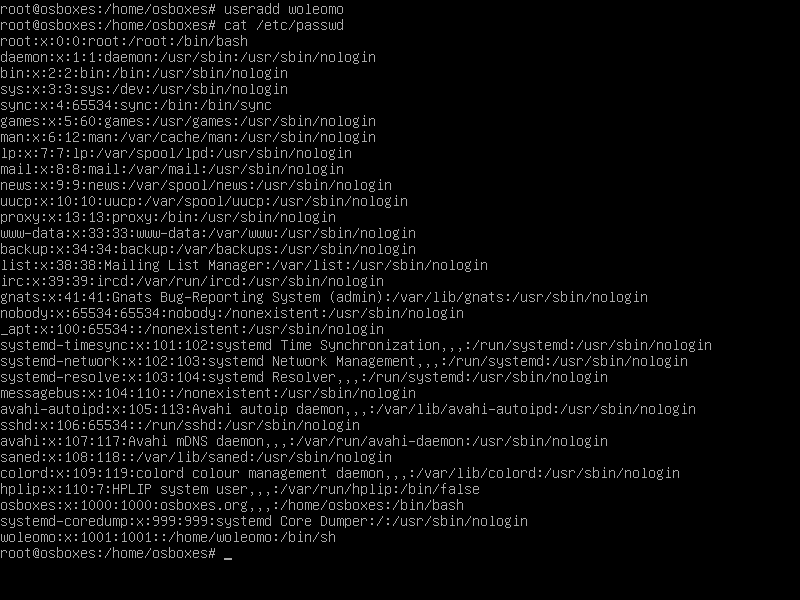
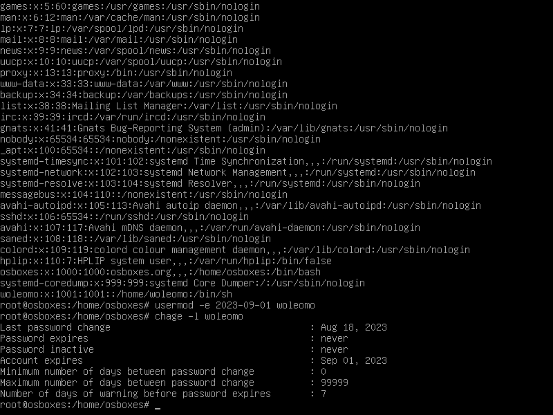
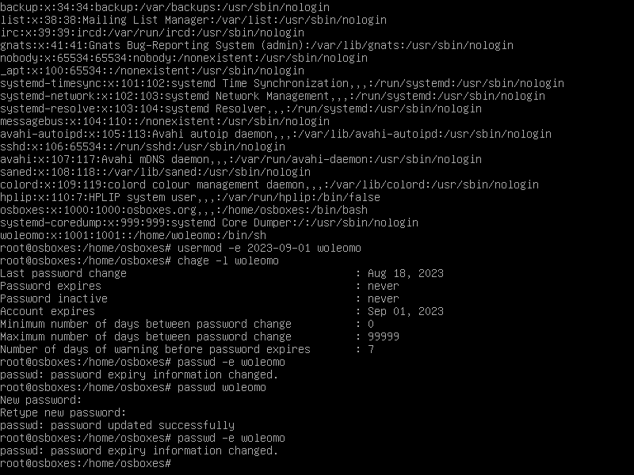
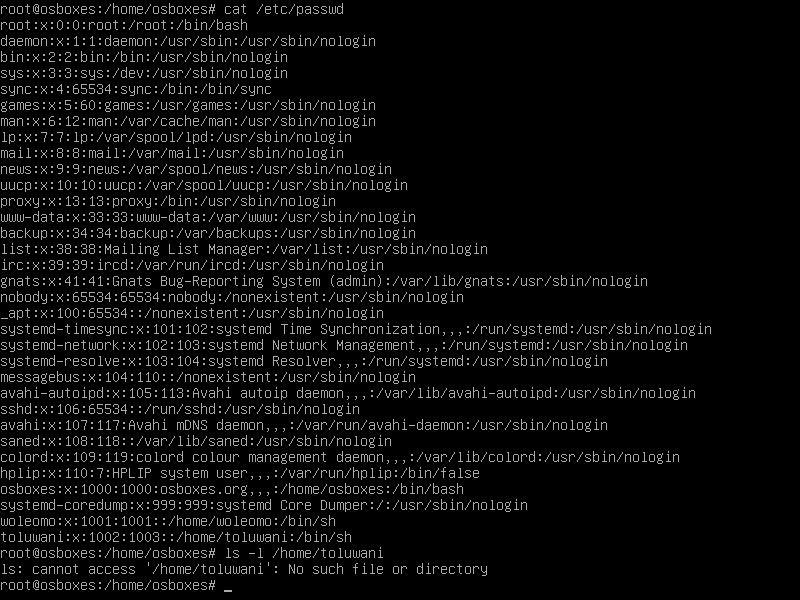
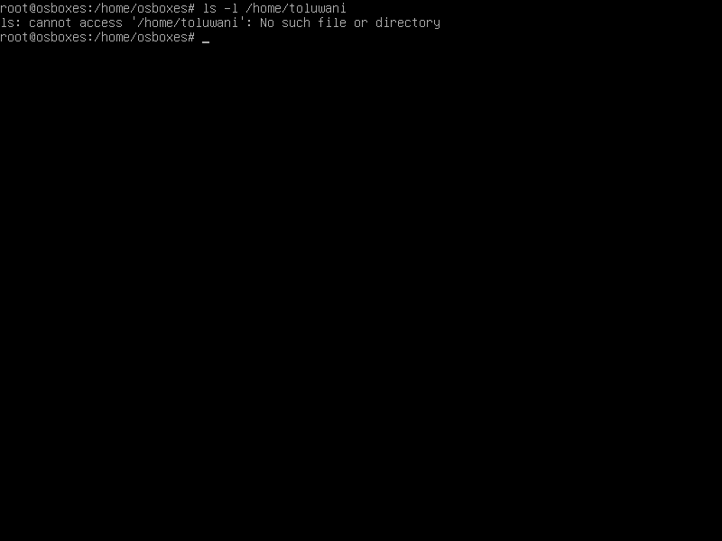

STEP ONE: Created a user using the user add command 

STEP TWO: Set an expiry date for the user using the usermod -e command and added the specific date with the username.

STEP THREE: Then i run the command to add a password to the user created and also prompt the command to change using the passwd -e username command 

STEP FOUR: A group was created and named Altschool and was attached to the user by running the command groupadd, usermod -a -G respectively

STEP FIVE: The group (Altschool) was allowed to run cat /etc/group command the output is attached here 

STEP SIX: I created another user with a home directory and names it toluwani and the screenshot is attached below

